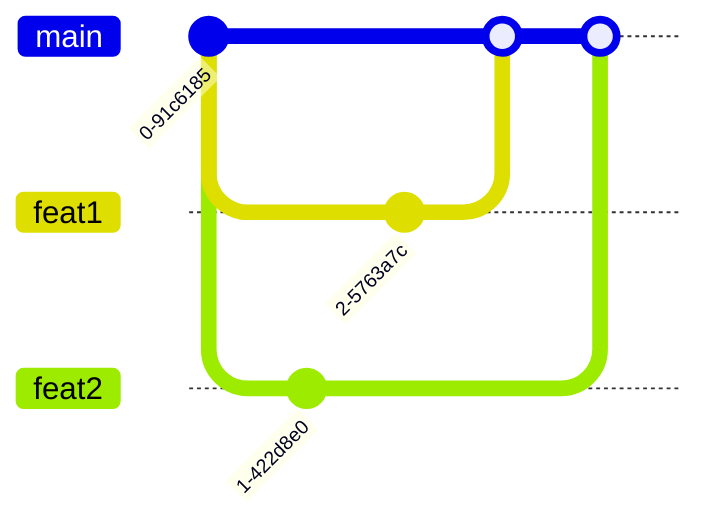

# sop

## Contributing Guide

```mermaid
gitGraph
    commit
    branch feat1
    branch feat2
    commit
    checkout feat1
    commit
    checkout main
    merge feat1
    merge feat2
```

1. Fork from wanlong-church/sop
2. Create feature branch
3. Commit on your feature branch
4. Push to your own fork
5. Create pull request